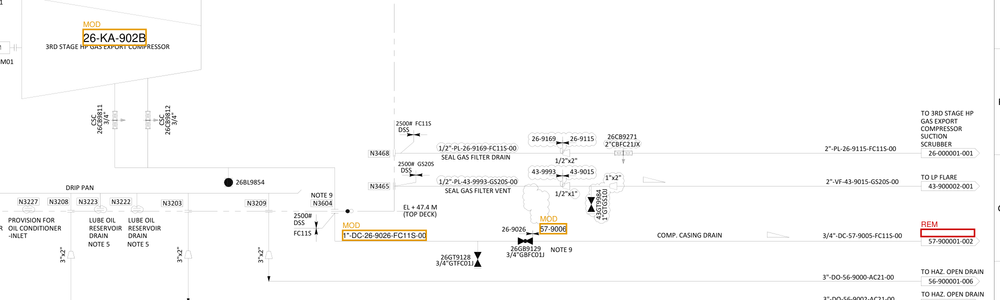

# Demo Walkthrough

No screen recording — this file is the fallback the assignment explicitly allows.
Every command below is copy-pasteable and reproduces exactly what's shown.

Sample pair used: `demo-native-a` / `demo-native-b`, a synthesized Rev A -> Rev B
of a real supplied P&ID (`data/samples/raw/export_gas_compressor.pdf`), with 6
authored edits — see `data/samples/ground_truth.json` and the README's "Sample
data & provenance" section.

## 1. Reproducible run: ingest -> delta -> report

```bash
make setup && make samples
python -m src.cli run demo-native-a demo-native-b --out-dir output/native
```

```
Delta: {'added': 2, 'removed': 1, 'modified': 3} (6 total changes)
Report: output/native/delta_report.md
Report (JSON): output/native/delta_report.json
Trace: traces/96199291-826e-46f9-ba98-3fe29d8f54b5.json
```

`output/native/delta_report.md`:

```
# Delta Report: demo-native-a -> demo-native-b

- **PID A**: `demo-native-a`
- **PID B**: `demo-native-b`
- **Elements compared**: 695 (A) vs 696 (B)
- **Unchanged**: 691
- **Changes**: 6 total (2 added, 1 removed, 3 modified)
- **By category**: dimension: 1, note: 1, tag: 2, text: 2

## Sheet 0

- **[MODIFIED] [tag]** `mod-768f8edcbb84-ebfbd0945c2c` at (447, 404) — Changed and moved: '26-KA-902' -> '26-KA-902B' (moved 5.6pt) (confidence: 0.93)
- **[MODIFIED] [text]** `mod-16b01b4b47f9-a9b591f7c23f` at (812, 559) — Text changed: '57-9005' -> '57-9006' (confidence: 0.90)
- **[REMOVED] [text]** `rem-2f812c6ac76f` at (1117, 563) — Text removed: 'TO CLOSED DRAIN' (confidence: 1.00)
- **[MODIFIED] [dimension]** `mod-a357c3582f16-fa7eac266fa4` at (654, 564) — Text changed: '3/4"-DC-26-9026-FC11S-00' -> '1"-DC-26-9026-FC11S-00' (confidence: 0.93)
- **[ADDED] [tag]** `add-761de8b05f02` at (900, 699) — New tag added: '26-PSV-9099' (confidence: 1.00)
- **[ADDED] [note]** `add-09de55de4eb3` at (900, 714) — New note added: 'NOTE 99 ADDED PSV PER MOC-1042.' (confidence: 1.00)
```

Exactly the 6 authored ground-truth edits, correctly typed and located — nothing
missed, nothing invented (see `tests/test_integration.py` for the automated
assertion of this).

## 2. Bonus: delta markup overlay

```bash
python -m src.cli markup demo-native-a demo-native-b --out output/native/markup.pdf
```

Redline boxes drawn directly onto PID B's actual page — amber `MOD` for
modified, red `REM` for removed, green `ADD` for added (legend top-left of the
PDF):



`26-KA-902` -> `26-KA-902B`, the line-size change on `DC-26-9026-FC11S-00`, the
`57-9005` -> `57-9006` renumber, and the removed `TO CLOSED DRAIN` callout are
all boxed exactly where they are on the real drawing.

## 3. Grounded chat exchange

```bash
python -m src.cli chat demo-native-a demo-native-b \
  -q "What changed with tag 26-KA-902, and was anything removed near the closed drain?"
```

```
[MOCK LLM — no ANTHROPIC_API_KEY/OPENAI_API_KEY configured; this is a template
extractive answer over retrieved, cited context, not a generated one]
Question: What changed with tag 26-KA-902, and was anything removed near the closed drain?
Most relevant retrieved evidence:
- [delta:rem-2f812c6ac76f] removed text: Text removed: 'TO CLOSED DRAIN'
- [pid_a:demo-native-a@p0] TO CLOSED DRAIN
- [delta:mod-768f8edcbb84-ebfbd0945c2c] modified tag: Changed and moved: '26-KA-902' -> '26-KA-902B' (moved 5.6pt)
- [pid_a:demo-native-a@p0] 26-KA-902
- [pid_b:demo-native-b@p0] 26-KA-902
- [delta:add-761de8b05f02] added tag: New tag added: '26-PSV-9099'
- [pid_a:demo-native-a@p0] TAG NUMBER
- [pid_b:demo-native-b@p0] TAG NUMBER

(grounded=True, citations=8, model=mock, cost=$0.000000)
```

Both parts of the compound question are answered correctly with exact
citations back to the delta report and both PID revisions — no API key
involved. **With `ANTHROPIC_API_KEY` or `OPENAI_API_KEY` set in `.env`**, the
exact same command produces a real generated (not extractive) answer over this
same retrieved, cited context — no code change, just `LLM_PROVIDER`/key in
`.env`.

Every request above also wrote a full trace to `traces/<request_id>.json`
(ingest/delta/retrieve/llm_call/answer spans with timings) and structured JSON
log lines to `logs/app.jsonl` — see README "Observability".

## 4. Eval scorecard

```bash
make eval
```

```
========================================================================
DELTA ENGINE SCORECARD
========================================================================
  [native] precision=1.00 recall=1.00 f1=1.00  (TP=6 FN=0 FP=0)
  [scanned] precision=0.60 recall=1.00 f1=0.75  (TP=6 FN=0 FP=4)
    SPURIOUS predictions (false positives): ['mod-8a510cde6e8a-04f5b0d4dd6d', 'mod-bd07fb05c7c4-623cceda117d', 'mod-28b89414842d-3dce15d96dbf', 'mod-f21a0047de5a-5a9616d62418']

========================================================================
CHAT SCORECARD
========================================================================
  accuracy=0.86  groundedness_rate=1.00  citation_accuracy=0.22

  Failure table (incorrect or ungrounded answers):
    [qa-6] FAIL — "What full description appears next to tag 26-KA-902 on the base revision?"
        answer: [MOCK LLM — no ANTHROPIC_API_KEY/OPENAI_API_KEY configured; this is a template extractive answer over retrieved, cited context, not a generated one]
Question: W...
========================================================================

Saved scorecard -> eval/results/1784874830.json
```

The native-PDF path is exact (1.00/1.00/1.00). The scanned-PDF path finds every
real edit (recall 1.00) but picks up 4 OCR-noise false positives (precision
0.60) — an honest, quantified cost of OCR on a dense technical drawing, not
hidden. Chat gets 6/7 correct and grounded; the one failure is a genuine
lexical-retrieval limitation (see README "Candid failures") left unfixed on
purpose rather than tuned away to inflate this number.

## 5. Tests

```bash
make test
```

```
20 passed in 0.71s
```

Includes an integration test (`tests/test_integration.py`) that runs the real
sample pair through the full ingest -> delta pipeline and asserts the output
matches ground truth exactly, not just that it "runs."
