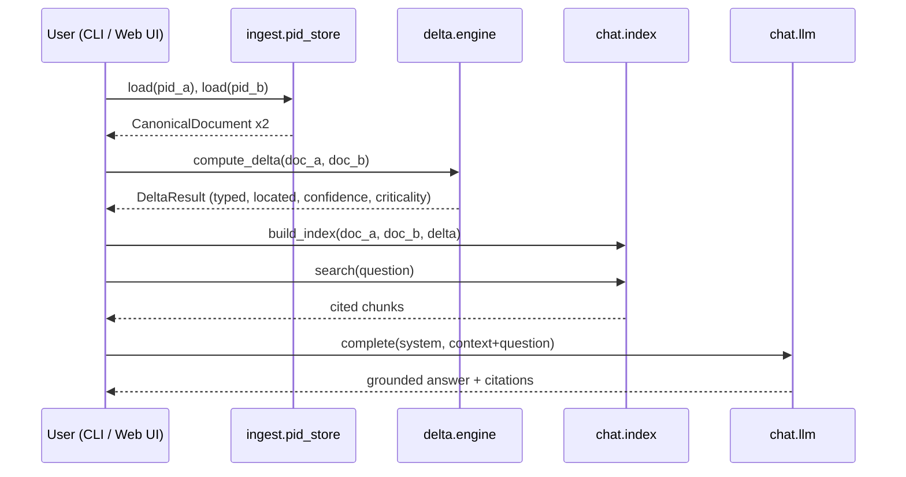

# Architecture

## The canonical representation seam

Every ingestion adapter — native PDF, scanned PDF, DWG/DXF — implements one
interface (`src/ingest/base.py::FormatAdapter`) and produces one output type:
`CanonicalDocument` (`src/canonical/model.py`).

```python
class FormatAdapter(ABC):
    @classmethod
    def sniff(cls, path: Path) -> bool: ...
    def parse(self, path: Path, pid: str, revision_label: str | None) -> CanonicalDocument: ...
```

`CanonicalDocument` is format-agnostic: pages, each with typed, located,
confidence-scored `Element`s (tag / dimension / note / text / table_cell /
geometry), each with a bounding box in consistent page-point space regardless
of whether it came from a PDF text layer, OCR, or a DXF entity.

Everything downstream — alignment, the delta engine, retrieval, chat, markup —
depends only on `CanonicalDocument`. None of it imports a format-specific
adapter. **To add a 4th format, write one class with `sniff()` + `parse()`;
nothing else in the codebase changes.**

## Request flow



Every stage above is wrapped in a trace span (see [Observability](observability.md))
so a single request produces one inspectable `traces/<request_id>.json` file
covering ingest → delta → retrieve → LLM call → answer.

## Why this shape

- **Determinism where it matters.** Ingestion, alignment, classification, and
  confidence scoring are pure Python/regex/rapidfuzz — zero LLM calls, so the
  structural delta is byte-identical run to run. LLM non-determinism is
  isolated entirely to the chat-answer layer.
- **One retrieval surface, three sources.** The chat index treats PID A, PID
  B, and the delta report as equal, citable sources — a "what changed"
  question and a "what does the base revision say" question go through the
  exact same retrieval path.
- **Everything is swappable behind an interface.** Format adapters
  (`FormatAdapter`), LLM providers (`LLMProvider`), and even the delta report
  renderer are single-interface, multi-implementation — see
  [Ingestion](formats.md) and [Grounded chat](chat.md).
