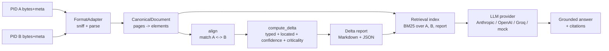

# Document Delta & Grounded Chat

Given two PIDs (revisions of the same engineering document), this system ingests
both regardless of format, computes a structured delta, renders a human- and
machine-readable delta report, and answers questions over both revisions and
the delta — with citations.

It's built around one idea: a **canonical representation** that every format
(native PDF, scanned PDF, DWG/DXF) normalizes into, so the delta engine,
retrieval, chat, and markup layers never touch format-specific code.



## Quickstart

```bash
make setup     # venv + deps (app + docs) + tesseract check
make samples   # synthesize the demo revision pairs
make run       # ingest -> delta -> report on the native-PDF pair
make chat      # grounded chat REPL
make ui        # web dashboard + chat + eval scorecard at :8000
make eval      # scorecard: delta P/R/F1 + chat accuracy/groundedness
make docs      # this documentation site, served locally
```

No LLM API key is required to run any of the above — see [Grounded chat](chat.md)
for the provider-agnostic client and its offline mock fallback.

## Where to go next

- **[Architecture](architecture.md)** — the canonical-representation seam and why it's the crux of the design.
- **[Ingestion & formats](formats.md)** — what's fully working (native PDF, scanned PDF/OCR) vs. a real stub (DWG/DXF).
- **[Delta engine & criticality](delta-engine.md)** — alignment, classification, confidence, and the red/yellow/green signal.
- **[Grounded chat](chat.md)** — retrieval, citations, refusal behavior, and swapping LLM providers (including a free one).
- **[Observability](observability.md)** — tracing, structured logs, metrics, failure visibility.
- **[Evaluation](eval.md)** — the labeled ground truth, scorecard, and candid failure modes.
- **[Web UI](ui.md)** — the dashboard, chat, and eval screens.
- **[Output reference](output-reference.md)** — the exact shape of every artifact this system produces, with real example values.
