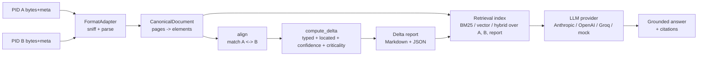

# DeltaIQ

Given two PIDs (revisions of the same engineering document), DeltaIQ ingests
both regardless of format, computes a structured delta, renders a human- and
machine-readable delta report, and answers questions over both revisions and
the delta — with citations.

It's built around one idea: a **canonical representation** that every format
(native PDF, scanned PDF, DWG/DXF) normalizes into, so the delta engine,
retrieval, chat, and markup layers never touch format-specific code.

---

## What it does

**Format-agnostic ingestion** · Native PDF, scanned PDF (OCR), and DXF all
normalize into one `CanonicalDocument` shape — pages of typed, located,
confidence-scored elements. [Ingestion & formats →](formats.md)

**Deterministic delta engine** · Alignment, classification, and a
red/yellow/green criticality signal — pure Python/regex, zero LLM calls, so
the same input always produces the same delta.
[Delta engine & criticality →](delta-engine.md)

**Grounded chat with citations** · BM25 lexical retrieval by default (with
optional vector/hybrid backends), a provider-agnostic LLM client
(Anthropic/OpenAI/Groq/mock), and a hard refusal path when nothing is
grounded enough to answer. [Grounded chat →](chat.md)

**Production data & infra stack, opt-in** · MongoDB, Pinecone/Chroma, MinIO,
Redis/Celery, Langfuse, and DVC — every backend has a zero-infra default, so
none of this is required to run the system. [Data & infrastructure →](infrastructure.md)

**Kubernetes & Terraform** · Real manifests and GCP IaC for a production
deployment — HPA/KEDA autoscaling, an nginx ingress, GCS/Memorystore/GKE —
validated offline, not yet deployed to a live cluster.
[Deployment →](deployment.md)

**Observability by default** · Every request is traced end-to-end to a
self-contained JSON file, with structured logs, `make metrics`, and an
optional Prometheus/Grafana stack for continuous monitoring.
[Observability →](observability.md)

---

## Architecture at a glance



Everything above the dotted line between `CanonicalDocument` and the delta
engine is format-specific; everything below it is not. See
[Architecture](architecture.md) for the full request-flow diagram and the
production data/storage topology.

## Quickstart

```bash
make setup     # venv + deps (app + docs) + tesseract check
make samples   # synthesize the demo revision pairs
make run       # ingest -> delta -> report on the native-PDF pair
make chat      # grounded chat REPL
make ui        # web dashboard + chat + eval scorecard at :8000
make eval      # scorecard: delta P/R/F1 + chat accuracy/groundedness
make docs      # this documentation site, served locally
```

No LLM API key is required to run any of the above — see [Grounded chat](chat.md)
for the provider-agnostic client and its offline mock fallback. Nothing in
[Data & infrastructure](infrastructure.md) is required either — `make infra-up`
opts into the real backends when you want them.

## Status at a glance

| Area | Status |
|---|---|
| Native PDF / scanned PDF ingestion | Fully working |
| DWG/DXF ingestion | Real DXF adapter; `.dwg` needs an external conversion pre-step |
| Delta engine (alignment, criticality) | Fully working, deterministic |
| Grounded chat | Fully working — BM25 default, vector/hybrid optional |
| Web UI | Fully working — dashboard, chat, eval, infra status page |
| Metadata / blob / vector stores | Zero-infra defaults + real Mongo/MinIO/Chroma/Pinecone backends |
| Background jobs (Celery) | Wired up, optional — `CELERY_TASK_ALWAYS_EAGER` for sync-only use |
| Kubernetes manifests | Validated offline (kubeconform); not deployed to a live cluster |
| Terraform (GCP) | Creation-only, local state; not applied |

## Version history

| Version | Highlights |
|---|---|
| **2.1.0** | Kubernetes manifests + GCP Terraform IaC (creation only, not deployed); credential redaction fix for logged/rendered connection strings |
| **2.0.0** | Production data/infra stack — MongoDB, Pinecone/Chroma, MinIO, Langfuse, Redis/Celery, Prometheus/Grafana, DVC; API schemas + request middleware |
| **1.1.0** | Criticality signal (🔴/🟡/🟢), web UI, MkDocs site, Groq free-tier provider, reshaped eval scorecard |
| **1.0.0** | Initial submission — ingestion, delta engine, grounded chat, markup overlay, tracing, eval harness |

See [CHANGELOG.md](https://github.com/bhaviknagre/DeltaIQ/blob/main/CHANGELOG.md)
for the full, unabridged history.
